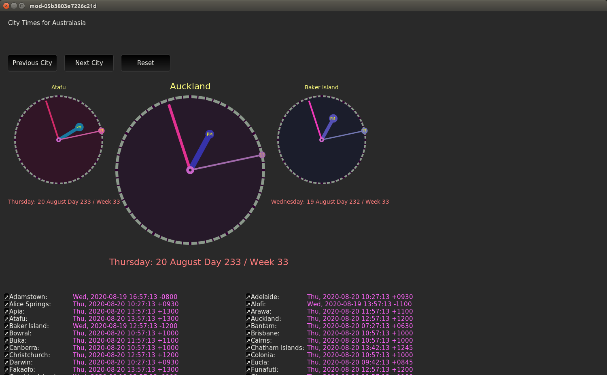

Run with a MongoDb-backed-cache with a Time-To-Live of  8 hours...
```
 cargo run use_cache ttl=480
```
## Application Features

#### The Date-And-Time.com Druid-UI


#### Some Resizeable Clock


#### An Animation


## Code Coverage

#### First install grcov
```
cargo install grcov
```
#### The run the code coverage in a terminal
```
#Only once...
export CARGO_INCREMENTAL=0;
export RUSTFLAGS="-Zprofile -Ccodegen-units=1 -Copt-level=0 -Clink-dead-code -Coverflow-checks=off -Zpanic_abort_tests -Cpanic=unwind";
export RUSTDOCFLAGS="-Cpanic=abort"

#in crate root...
cargo +nightly test --test mod  -- tests  cache
grcov ./target/debug/  -t html --llvm --branch --ignore-not-existing -o ./target/debug/coverage/
```
#### View Result at ```/target/debug/coverage/index.html```
